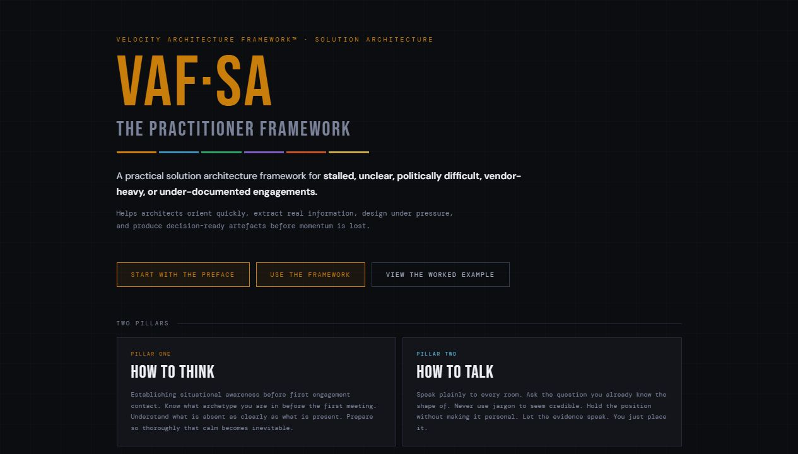
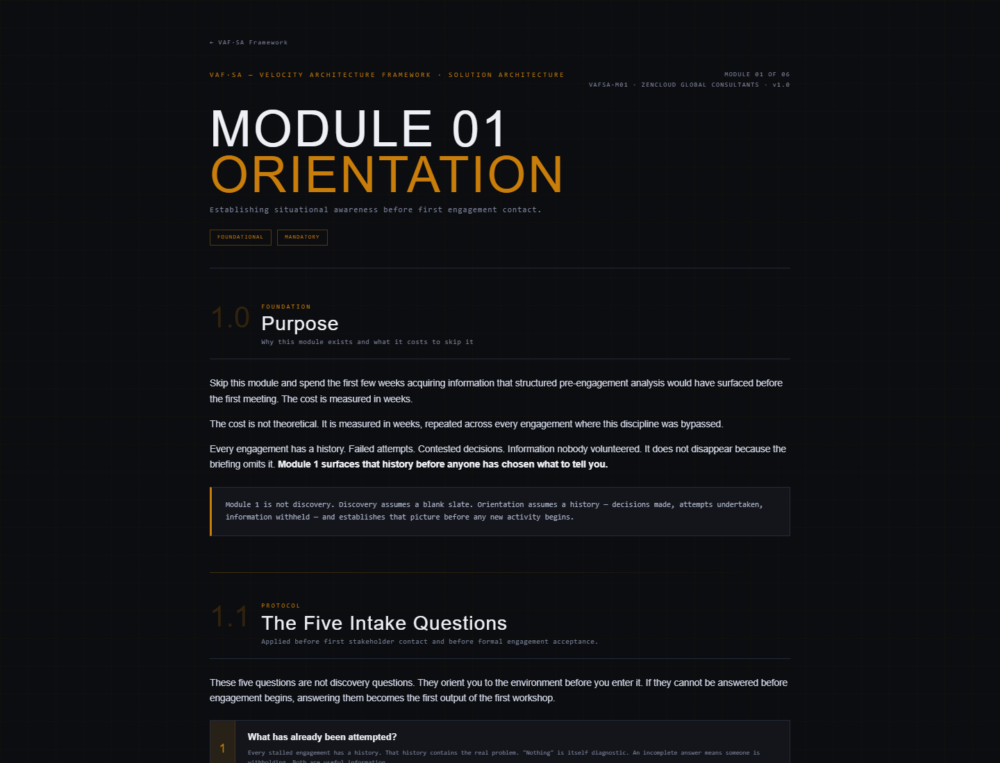
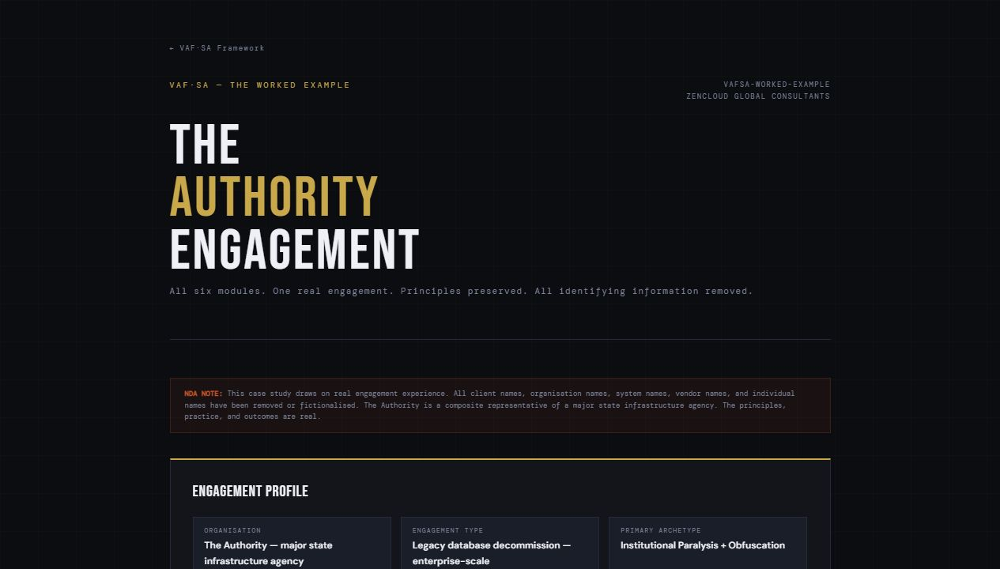

# OrdoAnimi Architecture

OrdoAnimi Architecture is a practitioner framework for solution architects focused on practical delivery, architecture decisions, governance, and execution.

## Start Here

If you landed in this repository from OrdoAnimi, LinkedIn, or search, use the reader-facing site first.

| Need | Use this |
|---|---|
| Understand OrdoAnimi Architecture | [OrdoAnimi Architecture home](https://architecture.ordoanimi.com/) |
| Navigate the full public site | [OrdoAnimi Architecture site map](https://architecture.ordoanimi.com/site-map.html) |
| Start the practitioner method | [Module 01 - Orientation](https://architecture.ordoanimi.com/modules/module-01-orientation.html) |
| Use the toolkit | [Solution Architecture Toolkit](https://architecture.ordoanimi.com/toolkit.html) |
| Use cloud reference material | [Cloud Architecture Reference](https://architecture.ordoanimi.com/cloud-reference/) |
| Read the worked example | [Worked Example](https://architecture.ordoanimi.com/worked-example.html) |
| Understand ecosystem placement | [Ecosystem Map](docs/ecosystem-map.md) |
| Review usage terms | [Usage Terms](USAGE-TERMS.md) |

GitHub is the source of truth. GitHub Pages is the reader-facing publication layer.

## Purpose

OrdoAnimi Architecture exists to help solution architects operate in difficult delivery conditions: stalled engagements, unclear ownership, incomplete documentation, vendor pressure, weak governance, and political ambiguity.

It is practical rather than theoretical. The framework gives practitioners a structured way to read the environment, extract the information that matters, design at the right altitude, produce usable artefacts, communicate across stakeholder groups, and keep delivery moving.

## Who It Is For

- Solution architects working in complex or poorly documented delivery environments.
- Enterprise architects who need a delivery-level companion to architecture governance.
- Delivery leads who need architecture decisions converted into executable work.
- Architecture reviewers assessing whether a design is grounded, traceable, and fit for governance.
- Consultants using OrdoAnimi methods in client engagements.

## What It Does

The current repository provides a static framework site with:

- A framework homepage in `index.html`.
- A public site map in `site-map.html`.
- A preface for practitioner context and operating mindset.
- A lexicon defining the framework terms.
- Six solution architecture modules:
  - Module 01 - Orientation
  - Module 02 - Intelligence
  - Module 03 - Design
  - Module 04 - Artefacts
  - Module 05 - Communication
  - Module 06 - Velocity Loop
- Supplementary resources:
  - Workshop playbook
  - Escalation protocol
  - Worked example
- Four engagement archetypes:
  - The Obfuscation Engagement
  - The Negligent Void
  - The Institutional Paralysis
  - The Silo Engagement
- Solution Architecture Toolkit in `toolkit.html`.
- Cloud Architecture Reference in `cloud-reference/`.
- Practical artefact guidance including CIS, Architecture on a Page, heat map, ADR, stakeholder concern register, SA toolkit artefacts, and TRA-readiness material.

## Live Demo

[OrdoAnimi Architecture](https://architecture.ordoanimi.com/)

## Screenshots







## How It Fits the Ecosystem

OrdoAnimi Architecture is the solution architecture delivery module of the broader OrdoAnimi ecosystem.

- **The OrdoAnimi Framework** provides the enterprise architecture, decision-governance, and architecture operating model context — and is also the commercial advisory front door and delivery wrapper for architecture-led AI delivery.
- **OrdoAnimi Architecture** translates that context into field practice for solution architects.
- **EA Artefact Generator** can support the creation of structured artefacts and export-ready architecture content aligned to the framework.
- **PMO Portal** connects architecture decisions to delivery governance and execution visibility.
- **Velocity Academy** provides learning, courses, certification, books, and practitioner pathways.

OrdoAnimi Architecture should stay focused on practitioner guidance and solution architecture execution. It should link to the broader framework and tools rather than duplicate them.

See [docs/ecosystem-map.md](docs/ecosystem-map.md) for the full ecosystem map.

## Tech Stack

Confirmed from the current files:

- Static HTML
- Inline CSS
- Google Fonts loaded from HTML pages
- No package manager or build system currently present

Primary files:

- `index.html`
- `site-map.html`
- `preface.html`
- `lexicon.html`
- `workshop-playbook.html`
- `escalation-protocol.html`
- `worked-example.html`
- `toolkit.html`
- `cloud-reference/index.html`
- `modules/module-01-orientation.html`
- `modules/module-02-intelligence.html`
- `modules/module-03-design.html`
- `modules/module-04-artefacts.html`
- `modules/module-05-communication.html`
- `modules/module-06-velocity-loop.html`

## How to Run Locally

This is a static HTML site. It can be opened directly in a browser from `index.html` or served with any local static file server.

No `package.json` or npm scripts are currently present.

## Deployment

Deployment is documented in [DEPLOYMENT.md](DEPLOYMENT.md).

Production URL:

```text
https://architecture.ordoanimi.com/
```

## Project Status

Portfolio-ready and practitioner-usable.

Productisation still requires release/versioning discipline, formal contribution boundaries, and a final decision on commercial licensing posture. Public visitor onboarding, deployment documentation, usage terms, and ecosystem routing are now present.

## Roadmap

Near-term improvements:

- Add governance-review examples showing how artefacts map to architecture review and delivery execution.
- Add a small release history or changelog.
- Add consistent footer/site-map links to every subpage if further packaging is required.
- Review whether selected toolkit artefacts should have standalone rendered pages.

## Security and Data Notes

The repo appears to be a static content site. It does not require environment configuration, API keys, or runtime secrets based on the current files inspected.

The worked example is described in the site as NDA-clean. Do not add client-identifying material or confidential engagement content to this repository.

## Usage Terms

Usage terms are documented in [USAGE-TERMS.md](USAGE-TERMS.md).

The OrdoAnimi Architecture method, terminology, modules, diagrams, templates, toolkit material, and practitioner guidance are part of the OrdoAnimi ecosystem.

This repository is licensed under CC BY 4.0 — free to use, attribution appreciated. See [LICENSE](LICENSE).

---
© 2026 Phil Myint / The OrdoAnimi Group · CC BY 4.0
